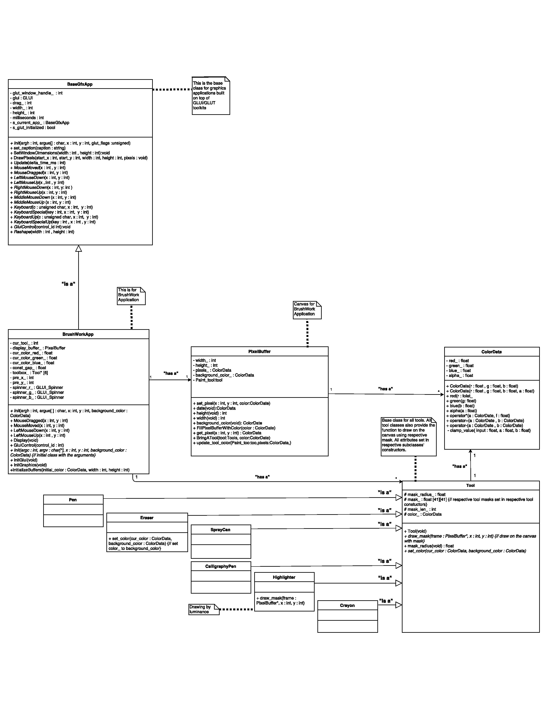

# Design Justifications for BrushWork
#### Group Name:
Group A1

#### Members:
- Tiannan Zhou
- Zhangjun Xu
- Yu Xian Ang

#### Instructions
> Respond to each of the design questions below.  Make your answers factual and compelling.  Where appropriate, reference alternative designs you considered, code snippets, and diagrams within your writing in order to be clear and back up your claims.  As we have discussed in class, when writing with reference to figures make sure to tell the reader what to look for in the diagram or what exactly you want the reader to notice in the code snippet.  Remember that the design of your project is worth 1/3 of the total project grade.  Also remember that when grading the design portion of the project, this design justification document is the only thing we will look at.  This document must stand on its own.  Rather than linking to your actual code, carefully pick the most important code snippets from your project to include here in order to provide convincing detail for your answers to the questions below.


## 1  Design Question One
> This iteration of the project is all about tools. Naturally, a key design decision is how these tools are represented. Each tool has several characteristics, including the shape of the tool, its size, and the way it blends with the canvas when the tool is applied. Some tools share characteristics with other tools, such as how the pen and calligraphy pen tools blend with the canvas in the same manner.
> First, in the **Design Description** section below, describe the design you developed to address this challenge. We expect that you will include at least one figure showing the relationships of the classes affected by your design. Second, in the **Design Justification** section below present the most compelling argument you can for why this design is justified.  Note that our expectation is that you will need to discuss the pros (and maybe cons) of your final design as compared to alternative designs that you discussed in your group in order to make a strong case for justifying your design.

### 1.1 Design Description
In our final software design, we decided to use an abstract base class and subclasses as the tools. The main idea of this design is the tools have the same attributes, which are color, size and mask, only their values are different. For example, spray can has larger coverage but pen is smaller. Figure 1 is a UML diagram illustrates our design for the tools.

###### Figure  1: UML diagram


To implement this design in C++, we first implement the abstract base class called Tool, which is shown in Figure 2.

###### Figure  2: Tool header code

```{C++}
/**
  * @brief This is a base class for each tool class.
  */
class Tool{
  public:
    Tool(void);

    /**
     *@brief Initialize the
     * draw mask on screen;
     */
    virtual void draw_mask(PixelBuffer *frame, int x, int y);

    /**
     * @brief used for fill the gap between the current position
     * and previous position
     */
    float mask_radius(void);

    /**
     * @brief set up the background color and current tools color.
     * getting ready when the tool color been changed.
     */
    virtual void set_color(ColorData cur_color, ColorData background_color);

  protected:
    float mask_radius_;
    float mask_[41][41];
    int mask_len_;
    ColorData color_;
};
```

Notice in Figure 2, the Tool class included all the attributes and functions a tool needs. Also notice that draw_mask and set_color is virtual because some subclasses have different way to implement it. The values of attributes, which are mask_, mask_len_, mask_radius_ and color_, are deferred to the constructors in respective subclasses of Tool. Besides, instead of putting the drawing function in BrushWorkApp, we put our drawing function inside Tool class because not all tools have the same algorithm. We put a pointer referred to BrushWorkApp.display_buffer_ as an argument for drawing function in order to let the function have the permission to modify the canvas. Additionally, the attribute mask_radius_ is referred to the gap length we should fill each time while we are dragging the tool. With all the tools we have, there are 2 different algorithms for draw_mask shown in Figure 3 and Figure 4.

###### Figure  3: draw_mask function in tool.cc

```{C++}
/**
 *@brief Initialize the
 * draw mask on screen;
 */
void Tool::draw_mask(PixelBuffer *frame, int x, int y) {
    ColorData temp_color;
    for (int i = 0; i < mask_len_; i++)
        for (int j = 0; j < mask_len_; j++) {
            int temp_x = i + x - CENTER;
            int temp_y = j + y - CENTER;
            if (!(temp_x < 0 ||
                  temp_x >= frame->width() ||
                  temp_y < 0 ||
                  temp_y >= frame->height()))
            {
                temp_color = (color_ * mask_[i][j]) +
                             (frame->get_pixel(temp_x, temp_y) *
                              (1 - mask_[i][j])
                             );
                frame->set_pixel(temp_x, temp_y, temp_color);
            }
        }
}
```

###### Figure  4: draw_mask function in highlighter.cc

```{C++}
/*
 * @brief since we do not want to highlighter to covered the color
 * was been painted on the board, we have to override draw_mask
 * make the highlighter more real.
 */
void Highlighter::draw_mask(PixelBuffer *frame, int x, int y) {
    ColorData temp_color;
    float intensity;
    for (int i = 0; i < mask_len_; i++)
        for (int j = 0; j < mask_len_; j++) {
            int temp_x = i + x - CENTER;
            int temp_y = j + y - CENTER;
            if (!(temp_x < 0 ||
                  temp_x >= frame->width() ||
                  temp_y < 0 ||
                  temp_y >= frame->height()))
            {
                intensity = mask_[i][j] * frame->get_pixel(temp_x, temp_y).luminance();
                temp_color = (color_ * intensity) +
                             (frame->get_pixel(temp_x, temp_y) *
                              (1.0 - intensity));
                frame->set_pixel(temp_x, temp_y, temp_color);
            }
        }
}
```
The difference between these 2 algorithms is in algorithm in Figure 4, used in highlighter class, the result color is decided by the luminance of the existing color on the canvas while in Figure 3, the result color is purely getting the percentage of the color of the tool and the current color on the canvas.

To complete the design, BrushWorkApp must have access to the tools. In Figure 5, BrushWorkApp keep all tools in an array called toolbox_. Then in Figure 6, BrushWorkApp uses set_color of the current tool and repetitively call draw_color of the current tool to fill in the gaps between previous position and current position on the canvas.

###### Figure  5: toolbox_ part and destructor in brushwork_app.h and brushwork_app.cc

```C++
// in brushwork_app.h
Tool* toolbox_[6];

// in brushwork_app.cc
toolbox_[0] = new Pen();
toolbox_[1] = new Eraser();
toolbox_[2] = new SprayCan();
toolbox_[3] = new CalligraphyPen();
toolbox_[4] = new Highlighter();
toolbox_[5] = new Crayon();

// destructor
BrushWorkApp::~BrushWorkApp(void) {
    if (display_buffer_) {
        delete display_buffer_;
    }
    for (int i = 0; i < 6; i++) {
        if (toolbox_[i]) {
            delete toolbox_[i];
        }
    }
}
```

###### Figure  6: MouseDragged() and LeftMouseDown() in brushwork_app.cc
```C++
void BrushWorkApp::MouseDragged(int x, int y) {
    toolbox_[cur_tool_]->set_color(ColorData(cur_color_red_,
                                            cur_color_green_,
                                            cur_color_blue_),
                                  display_buffer_->background_color());
    const_gap_ = toolbox_[cur_tool_]->mask_radius();
    float difX = x - pre_x_;
    float difY = y - pre_y_;
    float dist = sqrt((difX * difX) + (difY * difY));
    int i = 0;
    float dX = difX / dist;
    float dY = difY / dist;
    // fill the gap between current and previous position
    while(i * const_gap_ < dist){
        int tmpX = round(pre_x_ + i * const_gap_ * dX);
        int tmpY = round(pre_y_ + i * const_gap_ * dY);
        toolbox_[cur_tool_]->draw_mask(display_buffer_, tmpX, height() - 1 - tmpY);
        i++;
    }
    pre_x_ = x;
    pre_y_ = y;
}

void BrushWorkApp::LeftMouseDown(int x, int y) {
     std::cout << "mousePressed " << x << " " << y << std::endl;
    const_gap_ = toolbox_[cur_tool_]->mask_radius();
    toolbox_[cur_tool_]->set_color(ColorData(cur_color_red_,
                                            cur_color_green_,
                                            cur_color_blue_),
                                  display_buffer_->background_color());
    toolbox_[cur_tool_]->draw_mask(display_buffer_, x, height() - 1 - y);
    pre_x_ = x;
    pre_y_ = y;
}

```

Finally, it is worth noting that all the tools is deleted before exiting the program and it is BrushWorkApp responsible, can find in Figure 5. To use the BrushWorkApp in application code, the developer only need to know to call set_color(...) and draw_mask(...) to perform operations, they does not need to know the implementations. These member functions do everything needed to draw on the canvas.

### 1.2 Design Justification
The intuition of the design above is to create a reliable, easily maintainable and easily extensible class design for BrushWorkApp. Before this design came out, there is an alternative design for Tool class but the the virtual base class design is significantly better than the alternative design in many perspectives.

The alternative design is a very simple design that is to gather all tools together into a single Tool class, we called the design “the big Tool class”. The conclusion we get from this design is simple and easy to implement, but difficult to maintain or adding new tools. The figure below is a snippet of code from the big Tool class created in our first version BrushWorkApp.

###### Figure 7: The big Tool class containing all tools mask>
```C++
void Mask::switch_mask(int tool_number) {
    if (tool_number == this->cur_tool_)
        return;
    memset(this->matrix_, 0, sizeof this->matrix_);
    switch (tool_number) {
        case 0:
        //Initialize the mask for Pen
        ...
        this->mask_radius_ = R_PEN;
        break;

        case 1:
        //Initialize the mask for Eraser
        ...
        this->mask_radius_ = R_ERASER;
        break;

        case 2:
        //Initialize the mask for Spray Can
        ...
        this->mask_radius_ = R_CAN;
        break;

        case 3:
        //Initialize the mask for Calligraphy Pen
        ...
        this->mask_radius_ = R_REC;
        break;

        case 4:
        //Initialize the mask for Highlighter
        ...
        this->mask_radius_ = R_REC;
        break;

        case 5:
        //Initialize the mask for the special tool Crayon.
        ...
        this->mask_radius_ = R_CRAYON;
        break;

        default:
        std::cout << "The tool does not exist." << std::endl;
    }
    this->cur_tool_ = tool_number;
    std::cout << "Now switch to Tool " << tool_number <<std::endl;
}
```
Notice in the figure, every time when the user switches tool, this switch_tool function is called and it will goes through the switch function, creates the mask of the tool then returns the mask to the BrushWorkApp to draw. Even though this design looks simple to debug and implement but we still argue that this design is not easy to maintain and extend.

For example, when adding in a new tool, we need to add a new case into the switch statement. When more and more tools are added, the switch statement will be extremely large and becomes hard to maintain. Moreover, we have only one draw function in BrushWorkApp class. If there are more than one tool has different drawing algorithm, then we need a large if statement that will make the whole program messy. In contrast to this, our latest class design is easier to maintain and extend. In virtual base class, every tool has their own class and draw algorithm. So it is easier to add a new class without messing the base class.

## 2  Design Question Two
> Unlike most of the tools, the Eraser returns the canvas to its original color. One of the challenges in this iteration is giving the eraser the authority or information required to have this effect while having minimal impact on the way the rest of the tools are defined.
> First, in the **Design Description** section below, describe the design you developed to address this challenge.  Second, in the **Design Justification** section below present the most compelling argument you can for why this design is justified.  Note that our expectation is that you will need to discuss the pros (and maybe cons) of your final design as compared to alternative designs that you discussed in your group in order to make a strong case for justifying your design.

### 2.1 Design Description
To design the eraser tool, we set set_color  function as a virtual function in the virtual base Tool class. Then we override set_color function in Eraser class and set color_ to background color. Therefore, when user switch tools between eraser and other tools, the color set does not conflict.

###### Figure 8: set_color function in Tool class

```C++
void Tool::set_color (ColorData cur_color, ColorData background_color) {
    color_ = cur_color;
}
```

###### Figure 9: set_color function in Eraser class

```C++
void Eraser::set_color(ColorData cur_color, ColorData background_color) {
    color_ = background_color;
}
```

### 2.2 Design Justification
The reason we design our Eraser class this way because it is much easier to maintain. Since we have both current color and background color as our set_color arguments, we could easily switch the color for a tool by overriding the function. This is definitely better than using an if statement to manage the colors for different tools.

## 3  Design Question Three
> A new developer on your team must add a new tool to BrushWork. This tool is called  _Pencil._ This tool is a single, non-transparent pixel that completely replaces the existing colors on the canvas in the same way as the pen or calligraphy pen blend.  
> Describe in the form of a tutorial (including code snippets) exactly what changes would need to be made to your program in order to fully integrate this new tool.

### Programming Tutorial: Adding a New Pencil Tool to BrushWork

1. To add a new pencil tool to BrushWork, first of all, you have to change the toolbox’s size in Brushwork.h.

    ###### Figure 10: Changes in "include/brushwork_app.h" for adding a new tool

    ```C++
    class BrushWorkApp : public BaseGfxApp {
     public:
    	...
     private :
               …
    	Tool* toolbox[7];  /** instead of 6**/
               …
    };
    ```

2. Declare a new instance for Pencil and stored in the toolbox[6].

    ###### Figure 11: Changes in "src/brushwork_app.cc" for adding a new tool

    ```C++
    …
    void BrushWorkApp::InitGlui(void) {
    …
    toolbox[0] = new Pen();
    toolbox[1] = new Eraser();
    toolbox[2] = new SprayCan();
    toolbox[3] = new CalligraphyPen();
    toolbox[4] = new Highlighter();
    toolbox[5] = new Crayon();
    toolbox[6] = new Pencil();
    ...
    }
    ```

3. Finally, implement pencil.h and pencil.cc as follow. The Pencil class is very similar to the Pen class.

    ###### Figure 12: Add a new head file called "include/pencil.h"
    ```C++
    #ifndef INCLUDE_PENCIL_H_
    #define INCLUDE_PENCIL_H_
    #include "include/tool.h"
    namespace image_tools {
    class Pencil : public Tool{
        public:
            Pencil(void);
    };
    } //namespace image_tools
    #endif //INCLUDE_PENCIL_H_
    ```

    ###### Figure 13: Add a new source file called "src/pencil.cc"
    ```C++
    #include "include/pen.h"

    namespace image_tools {

    Pencil::Pencil(void) {
      // initialize pencil’s mask_, mask_radius_ and mask_len_
    };
    }
    ```
