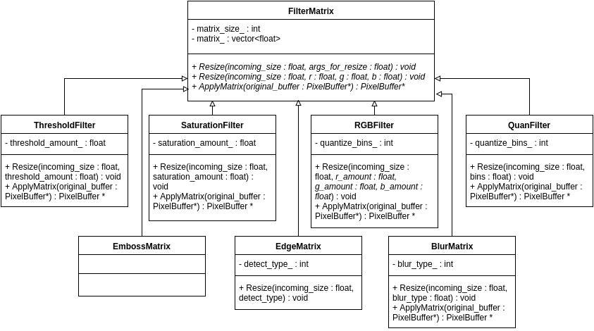

# Design Justifications for FlashPhoto
#### Group Name:
  group-A01

#### Members:
- Tiannan Zhou­
- Yu Xian Ang
- Zhangjun Xu

#### Instructions
> Respond to each of the design questions below.  Make your answers factual and compelling.  Where appropriate, reference alternative designs you considered, code snippets, and diagrams within your writing in order to be clear and back up your claims.  As we have discussed in class, when writing with reference to figures make sure to tell the reader what to look for in the diagram or what exactly you want the reader to notice in the code snippet.  Remember that the design of your project is worth 1/3 of the total project grade.  Also remember that when grading the design portion of the project, this design justification document is the only thing we will look at.  This document must stand on its own.  Rather than linking to your actual code, carefully pick the most important code snippets from your project to include here in order to provide convincing detail for your answers to the questions below.
> A few tips to maximize the success of your design document:
>   1. Make sure the **description** of your design decision only contains an objective description of how you structured your design and how it was implemented (specifically how your solution solves the problem given in the prompt). Save any arguments in favor of your design for the **justification** section.
>
>   2. Your justification will probably need to compare against at least one alternative, and you will need to provide a compelling argument for why your solution is better than the alternative.
>
>   3. Edit this file when writing your design document. Do not move or rename this file. Do not direct to any outside resources for your images or code. Place all images and code in this document. Please match the formatting of the [Example Design Document](https://github.umn.edu/umn-csci-3081F16/Example-Design-Document/blob/master/doc/DesignDocument.md) and [its source](https://raw.github.umn.edu/umn-csci-3081F16/Example-Design-Document/master/doc/DesignDocument.md?token=AAADyd5L8wd57F_qLX4Nf-2nVvfRlMj5ks5YH-qHwA%3D%3D) as precisely as possible, especially in regards to:
> 	- **Formatting code** (do not include images of your code, make sure that your code is formatted with C++ coloring)
> 	- **Inserting images**
> 	- **Numbered lists for your tutorial**
> 	- **Captioning your Figures**
>     - **Including the original prompts in their original quote form**
>
>  This formatting helps us grade your assignments effectively, and thus failure to meet these requirements may result in point deductions. Any material that is not presented in this design document will not be graded.
>   4. When including a class diagram, only show the classes and members that convey the point you're trying to make. For example, showing the class BaseGfxApp in a UML diagram will probably not be appropriate.


## 1  Design Question One
> This iteration of the project introduces the concept of filters. You had to implement several filters, which fell into two types: pixel-independent (where each pixel is filtered independently), and convolution-based (where filtering a pixel requires information about its neighboring pixels by means of a kernel). Naturally, a key design decision is how these filters are represented. Each filter has a different algorithm for modifying the canvas, and only some of these algorithms require kernels.
> First, in the **Design Description** section below, describe the design you developed to address this challenge. We expect that you will include at least one figure showing the relationships of the classes affected by your design. Second, in the **Design Justification** section below present the most compelling argument you can for why this design is justified.  Note that our expectation is that you will need to discuss the pros (and maybe cons) of your final design as compared to alternative designs that you discussed in your group in order to make a strong case for justifying your design.

### 1.1 Design Description
> In our final software design, we decided to use an abstract base class, called FilterMatrix, and we implemented the filters as subclasses of FilterMatrix. The key idea of this strategy is all filters have very similar behavior. Basically, all filters have a matrix and then apply the matrix on every pixel in the display, no matter it is pixel-independent or convolution-based. Figure 1.1 is a UML diagram of the implementation of our filters.


###### Figure 1.1: UML class diagram for the implementation of abstract base class strategy of the filters



>To implement this design in C++, we fully utilized the abstract base class strategy. Figure 1.2 showing the implementation of FilterMatrix, the abstract base class.


###### Figure 1.2: class snippet of FilterMatrix in filter_matrix.h
```C++
/**
 * @brief This class is the matrix tool which would be used by FilterManager
 */
class FilterMatrix {
 public:
  FilterMatrix();
  virtual ~FilterMatrix() {}
  /**
   * @brief apply a new size for a filter matrix
   *
   * @param[in] incoming_size the new size of this matrix
   */
  virtual void Resize(float incoming_size, float args_for_resize) {}
  virtual void Resize(float incoming_size, float r, float g, float b) {}
  /**
   * @brief apply the matrix on the buffer then return the cached buffer
   *
   * @param[in] original_buffer the display_buffer of GUI
   */
  virtual PixelBuffer* ApplyMatrix(PixelBuffer* original_buffer);

  int MatrixSize(void);

  void MatrixSize(int new_matrix_size);

  std::vector <std::vector<float> > Matrix(void);

  void Matrix(std::vector <std::vector<float> > new_matrix);

 private:
  int  matrix_size_;
  std::vector <std::vector<float> > matrix_;
};
```


> Notice in Figure 1.2, we have a matrix declared as a vector. This matrix works as a kernel for convolution-based filter. To fit it into different filters, we also implemented a function to initialize it, the function is called Resize. Note that we implemented 2 Resize virtual functions that take different arguments. The Resize function that takes 4 arguments is specially implemented for rgb filter while another Resize function is for the rest of the filters. Figure 1.3 is a snippet of Resize function from rgb filter and Figure 1.4 is a snippet from the caller function ApplyChannel in FilterManager.


###### Figure 1.3: Resize function of RGBFilter in f_rgb_filter.cc
```C++
void RGBFilter::Resize(float incoming_size,
                       float r_amount,
                       float g_amount,
                       float b_amount) {
  this->channel_color_red_ = r_amount;
  this->channel_color_green_ = g_amount;
  this->channel_color_blue_ = b_amount;
  int new_matrix_size = static_cast<int>(incoming_size);
  std::vector <std::vector<float> > new_matrix;
  new_matrix.resize(new_matrix_size, std::vector<float>(new_matrix_size));
  new_matrix[0][0] = 1;
  FilterMatrix::MatrixSize(new_matrix_size);
  FilterMatrix::Matrix(new_matrix);
}
```


###### Figure 1.4: ApplyChannel from FilterManager in filter_manager.cc
```C++
void FilterManager::ApplyChannel(PixelBuffer** display_buffer) {
  std::cout << "Apply has been clicked for Channels with red = "
            << channel_color_red_
            << ", green = " << channel_color_green_
            << ", blue = " << channel_color_blue_ << std::endl;
  filters_[6]->Resize(1,
                      channel_color_red_,
                      channel_color_green_,
                      channel_color_blue_);
  temp_buffer_ = filters_[6]->ApplyMatrix(*display_buffer);
  *display_buffer = temp_buffer_;
}
```


> Notice that in Figure 1.4, the caller function calls the Resize function with 1 as the incoming size. The incoming size is the size of the matrix, so size as 1 means it is pixel-independent. The other 3 arguments are put into the class variables of rgb filter. Convolution-based filter has a different implementation in Resize function. For an example, blur filter is a classic convolution-based filter. Figure 1.5 is a snippet of the Resize function of blur filter class, BlurMatrix. Figure 1.6 is the caller function.


###### Figure 1.5: Resize function of BlurMatrix in f_blur_matrix.cc
```C++
void BlurMatrix::Resize(float incoming_size, float blur_type) {
  this->blur_type_ = static_cast<int>(blur_type);
  int n = static_cast<int>(incoming_size) / 2;
  int new_matrix_size = n * 2 + 1;
  std::vector <std::vector<float> > new_matrix;
  new_matrix.resize(new_matrix_size, std::vector<float>(new_matrix_size));
  if (blur_type == -1) {
    float tot_cell = 2 * n * n + 2 * n + 1;
    float value_in_cell = 1.0 / tot_cell;
    for (int i = 0; i < new_matrix_size; i++) {
      for (int j = 0; j < new_matrix_size; j++) {
        int dis = fabs(i - n) + fabs(j - n);
        if (dis <= n)
          new_matrix[i][j] = value_in_cell;
        else
          new_matrix[i][j] = 0;
      }
    }
  } else {
    new_matrix.clear();
  }
  FilterMatrix::MatrixSize(new_matrix_size);
  FilterMatrix::Matrix(new_matrix);
}
```


###### Figure 1.6: ApplyBlur from FilterManager in filter_manager.cc
```C++
void FilterManager::ApplyBlur(PixelBuffer** display_buffer) {
  std::cout << "Apply has been clicked for Blur with amount = "
            << blur_amount_ << std::endl;
  filters_[0]->Resize(blur_amount_, -1);
  temp_buffer_ = filters_[0]->ApplyMatrix(*display_buffer);
  *display_buffer = temp_buffer_;
}
```


> Note that in the caller function ApplyBlur, it passes a variable, blur_amount_, as an incoming size to BlurMatrix’s Resize function. The blurriness of an image is based on the size of the kernel, the larger the size, the blurrier the effect. Notice the caller function also passes -1 as blur_type to the Resize function. This is because we implemented BlurMatrix in a way that can produce 2 types of blur filter, normal blur and motion blur. ApplyMatrix is another function that all filter has. This function is to apply the kernel into the display. Figure 1.7 is a snippet of ApplyMatrix for most of the convolution-based filter, this is implemented in the base class FilterMatrix.


###### Figure 1.7: ApplyMatrix from FilterMatrix in filter_matrix.cc
```C++
PixelBuffer* FilterMatrix::ApplyMatrix(PixelBuffer* original_buffer) {
  PixelBuffer* result_buffer;
  ColorData temp_color;
  result_buffer = new PixelBuffer(original_buffer->width(),
                                  original_buffer->height(),
                                  original_buffer->background_color());
  for (int x = 0; x < original_buffer->width(); x++)
    for (int y = 0; y < original_buffer->height(); y++) {
      temp_color = ColorData(0, 0, 0);
      int shift_length = matrix_size_ / 2;
      for (int i = 0; i < matrix_size_; i++)
        for (int j = 0; j < matrix_size_; j++) {
          if (matrix_[i][j] == 0)
            continue;
          int s_x = x + i - shift_length;
          int s_y = y + j - shift_length;
          if (s_x >= 0 && s_y >= 0 &&
              s_x < original_buffer->width() &&
              s_y < original_buffer->height()) {
            temp_color = original_buffer->get_pixel(s_x, s_y) *
                         matrix_[i][j] +
                         temp_color;
          } else {
            temp_color = ColorData() *
                         matrix_[i][j] +
                         temp_color;
          }
        }
      result_buffer->set_pixel(x, y, temp_color);
    }
  result_buffer->ValidPixel();
  return result_buffer;
}
```


> The algorithm used in ApplyMatrix is suitable for some convolution-based filters such as blur filter, edge filter and our special filter, emboss filter. Speaking of algorithm, we also implemented a better algorithm for motion blur with O(n) runtime. The original algorithm (ApplyMatrix)’s runtime is O(n^2), which is much slower than the optimized motion blur. Figure 1.8 is a snippet of ApplyMatrix function BlurMatrix.


###### Figure 1.8: ApplyMatrix function BlurMatrix in f_blur_matrix.cc
```C++
PixelBuffer* BlurMatrix::ApplyMatrix(PixelBuffer* original_buffer) {
  if (this->blur_type_ == -1) {
    return FilterMatrix::ApplyMatrix(original_buffer);
  } else {
    int n = MatrixSize() / 2;
    PixelBuffer* result_buffer;
    ColorData temp_color;
    float tot_cell = MatrixSize();
    float value_in_cell = 1.0 / tot_cell;
    int init_x, init_y;
    int delta_x, delta_y;
    if (this->blur_type_ == 0) {
      init_x = n;
      init_y = 0;
      delta_x = 0;
      delta_y = 1;
    } else if (this->blur_type_ == 1) {
      init_x = 0;
      init_y = n;
      delta_x = 1;
      delta_y = 0;
    } else if (this->blur_type_ == 2) {
      init_x = 0;
      init_y = 0;
      delta_x = 1;
      delta_y = 1;
    } else if (this->blur_type_ == 3) {
      init_x = 0;
      init_y = MatrixSize() - 1;
      delta_x = 1;
      delta_y = -1;
    }
    result_buffer = new PixelBuffer(original_buffer->width(),
                                    original_buffer->height(),
                                    original_buffer->background_color());

    for (int x = 0; x < original_buffer->width(); x++)
      for (int y = 0; y < original_buffer->height(); y++) {
        temp_color = ColorData(0, 0, 0);
        for (int i = 0, d_x = init_x, d_y = init_y;
             i < MatrixSize();
             d_x += delta_x, d_y += delta_y, i++) {
          int s_x = x + d_x - n;
          int s_y = y + d_y - n;
          if (s_x >= 0 && s_y >= 0 &&
              s_x < original_buffer->width() &&
              s_y < original_buffer->height()) {
            temp_color = original_buffer->get_pixel(s_x, s_y) *
                         value_in_cell +
                         temp_color;
          } else {
            temp_color = ColorData() * value_in_cell + temp_color;
          }
        }
        result_buffer->set_pixel(x, y, temp_color);
      }
      result_buffer->ValidPixel();
      return result_buffer;
  }
}
```


> Note that if the type is -1 that is the normal blur, we uses the original algorithm, else we it is motion blur, then we uses the optimized algorithm. Finally, it is worth noting that the developer does not have to know the implementation in these filters to use them. They just have to know how to the Resize and ApplyMatrix function and some specific conditions like for normal blur, the blur type is -1. After calling ApplyMatrix function, it will return the display with effects.


### 1.2 Design Justification
> The intuition of the program design above is to create an extensible, reliable and easily maintained program. We also thought of other alternative designs that are functional in this project, but we decided to use the final program design because it is significantly better in maintainability and extensibility compared to other alternative designs.


> Our initial design is based on “brute force” approach. The “brute force” approach is focus on simplicity. Thus, we just implement those filters in their respective functions. Although this is easier to implement, it is very difficult to maintain. Figure 1.9 is a replica of the “brute force” approach.


###### Figure 1.9: Brief “brute force” approach filter code
```C++

```


> From the Figure 1.9, it is obvious that the whole program will be a mess. It will be very difficult to maintain it. However, it is simple to implement because the whole function represents the filter itself. Although, this is a lot easier for us to implement it compared to our final design, we still argue that “brute force” approach has major disadvantage in terms of maintainability and extensibility.


> For example, adding a new feature into an existing filter. The new feature is to enable the user to change the intensity of the existing filter. To implement this new feature, we have to look into the code and find where to put it so that it won’t affect other filters. Maybe it is considered easy for a few filters, but if more and more features and filters added? Then, we need very large functions and many functions to include all these features and filters. In contrast to this, our final design is simpler and cleaner because all these filters are inside their respective classes. Moreover, all filters are isolated by classes, so they won’t affect each other if only adding things inside their own classes. Thus, our final design is more robust and easier to read, extend and maintain.


> We argued that our final design is more robust and better in isolation, maintainability and extensibility, but, to implement this design, much more complex knowledge of object-oriented programming and logic is needed. For example, we want to add a new feature to several filters but it is implemented differently in different filters. We would likely have to look through the relationships between these filters and discover the right place to implement the new feature.


## 2  Design Question Two
> One common software feature included in this iteration is the undo/redo mechanic, where any modification to the canvas can be reversed, and then optionally re-applied.
> First, in the **Design Description** section below, describe the design you developed to address this challenge.  Second, in the **Design Justification** section below present the most compelling argument you can for why this design is justified.  Note that our expectation is that you will need to discuss the pros (and maybe cons) of your final design as compared to alternative designs that you discussed in your group in order to make a strong case for justifying your design.

### 2.1 Design Description
 >For our final redo/undo design, we decided to use Vector as a container to store our previous pixel buffers in that vector and name it “cached_buffer_”,  and we implemented the redo/undo based on cached_buffer_. Figure 2.1 is a work flow design for our redo/undo tool.


###### Figure 2.1: Work flow design for redo/undo

 


 >To implement those function design in C++ code. First for all, we set the function will be calling as part of our frame. snippet 2.2 show, how we did, make the idea from idea to become real code.

###### Figure 2.2: C++ Code implement
 ```C++
 class StateManager {
  public:
   StateManager();
   ~StateManager() {
     for (int i = 0; i < cached_buffer_.size(); i++) {
       if (cached_buffer_[i])
         delete cached_buffer_[i];
     }
     cached_buffer_.clear();
   }
   void InitGlui(const GLUI *const glui,
                 void (*s_gluicallback)(int));


    * @brief Undoes the last operation applied to the canvas (not permanently; it
   /**
    * can still be re-done later)
    *
    */
   void UndoOperation(PixelBuffer** display_buffer);


   /**
    * @brief Re-does the last un-done operation applied to the canvas (not
    * permanently; it can be undone again later)
    *
    */
   void RedoOperation(PixelBuffer** display_buffer);


   void InsertNewBuffer(PixelBuffer* new_buffer);


  private:
   std::vector <PixelBuffer*> cached_buffer_;
   int size_limit_;
   int state_ptr_;
   void redo_toggle(bool select) {
     UICtrl::button_toggle(redo_btn_, select);
   }


   void undo_toggle(bool select) {
     UICtrl::button_toggle(undo_btn_, select);
   }


   /* Copy/move assignment/construction disallowed */
   StateManager(const StateManager &rhs) = delete;
   StateManager& operator=(const StateManager &rhs) = delete;


   /* data members */
   GLUI_Button *undo_btn_;
   GLUI_Button *redo_btn_;
 };
 ```
 >As the code shows above we declare a vector named cached_buffer_  as i mentioned before, and set the generic to PixelBuffer*. In addition, we also have three functions,for the “RedoOperation”  , “RedoOperation”  and  “InsertNewBuffer”. And could be calling those in the flashphoto_app.cc. The snippet 2.3 shows how those function been call.

###### Figure 2.3: How function been call in flashpotho_app.cc
 ```C++


 void FlashPhotoApp::GluiControl(int control_id) {
   switch (control_id) {
      /*
       * Part of code omit  	
       *
       *
       */
       case UICtrl::UI_APPLY_SATURATE:
       filter_manager_.ApplySaturate(&display_buffer_);
       state_manager_.InsertNewBuffer(display_buffer_);
       break;
     case UICtrl::UI_APPLY_CHANNEL:
       filter_manager_.ApplyChannel(&display_buffer_);
       state_manager_.InsertNewBuffer(display_buffer_);
       break;
     case UICtrl::UI_APPLY_QUANTIZE:
       filter_manager_.ApplyQuantize(&display_buffer_);
       state_manager_.InsertNewBuffer(display_buffer_);
       break;

      /*
       * Part of code omit  	
       *
       *
       */
     case UICtrl::UI_LOAD_CANVAS_BUTTON:
       PixelBuffer* temp_buffer;
       if ((temp_buffer = io_manager_.LoadImageToCanvas()) != NULL) {
         display_buffer_ = temp_buffer;
         SetWindowDimensions(display_buffer_->width(),
                             display_buffer_->height());
         state_manager_.InsertNewBuffer(display_buffer_);
       }
       break;
    ……
    …....
     case UICtrl::UI_SAVE_CANVAS_BUTTON:
       io_manager_.SaveCanvasToFile(this->display_buffer_);
       // Reload the current directory:
       io_manager_.file_browser()->fbreaddir(".");
       break;
     case UICtrl::UI_FILE_NAME:
       io_manager_.set_image_file(io_manager_.file_name());
       break;
     case UICtrl::UI_UNDO:
       state_manager_.UndoOperation(&display_buffer_);
       SetWindowDimensions(display_buffer_->width(),
                           display_buffer_->height());
       break;
      ……..
      ……..
     default:
       break;
   }
 ………...
 }
 ```
 >Notice the code above,the recorde been inserted into our cached_buffer_  since every change on the pixel buffer, even include load file. The figure 2.4 below showing the how does the record been saved in cached_buffer_   since the program start .

 ###### Figure 2.4: caced buffer status

  


###### Figure 2.5: undo operation

   


 >Notice the figure 2.5 above shows how the undo operation works when the undo function been called. Meanwhile, the function will move the move the state_point to the left(imaginary line) consistent by one position to recorded 4. Pay attention here, we are not actually to delete records 5, when the undo function done by call once  .


###### Figure 2.6: redo operation

  


 >The figure 2.6 shows, how the redo works. That is really simplify idea, if we did not modify anything on current buffer, then state_point will increase by one and move from record 4 to record 5. however , if we modified the pixel buffer since last undo, then the operation are going to different, as the figure 2.7, how we will reorganize our vector.

##### Figure 2.7 reorganize vector
 

 >notices , the figure above clearly to show us, we will replace the record 5 with the new buffer and  clear the rest of the records. As the figure 2.7 shows the record 5 has been replaced and 6 been deleted.


 >That is all how we define the redo and undo in our  project.


 ### 2.2 Design Justification
 >The justification for our redo/undo design are so simple. Because as we mentioned above we  will clean and reorganize our pix buffer as the figure 2.7 shows. Therefore, we do have three option to select either queue, stack and vector. However, the queue only can doing first in and first out, then we are unable to remove the element behind current element at the mid of our structure, when we want to insert a new record to our container. in addition, the similar situation will occur when we choose stack as a container to save our pixel buffer, according to the rule of the stack, we can not clean the element the at the front of our list when the size of element over the size of container. Until to here, we only left with vector, that is perfect what we want, the vector library has function call eraser() that could either remove the element from the end or binge of the container-list.  The figure 2.8 show how we using this function in our project
 ```C++
  void StateManager::InsertNewBuffer(PixelBuffer* new_buffer) {
   for (int i = this->cached_buffer_.size() - 1; i > state_ptr_; i--) {
     delete this->cached_buffer_[i];
     this->cached_buffer_.erase(this->cached_buffer_.begin() + i);
   }
 ……..
 Omit part of code here
 ……..  
 }


 ```

## 3  Design Question Three
> A new developer on your team must add a new filter to FlashPhoto. This filter is called  _Invert._ This filter performs the following conversion to all pixels in the canvas:
> ```
> newColor's red   = 1 - oldColor's red
> newColor's green = 1 - oldColor's green
> newColor's blue  = 1 - oldColor's blue
> ```
> Describe in the form of a tutorial (including code snippets) exactly what changes would need to be made to your program in order to fully integrate this new filter.

### Programming Tutorial: Adding a New Pencil Tool to FlashPhoto

1) To add a new filter, first of all, you have to implement a subclass of FilterMatrix called InvertFilter. The respective files are f_invert_filter.h and f_invert_filter.cc. InvertFilter is very similar to RGBFilter.


  ###### Figure 3.1: src/include/f_invert_filter.h
  ```C++
  #ifndef SRC_INCLUDE_F_INVERT_FILTER_H_
  #define SRC_INCLUDE_F_INVERT_FILTER_H_

  #include "include/filter_matrix.h"

  namespace image_tools {

  Class InvertFilter : public FilterMatrix{
  public:
    InvertFilter() : FilterMatrix::FilterMatrix(),
                channel_color_red_(1),
                channel_color_green_(1),
                channel_color_blue_(1) {}
    ~InvertFilter() {}    

    void Resize(float incoming_size,
              float r_amount,
              float g_amount,
              float b_amount);

    PixelBuffer* ApplyMatrix(PixelBuffer* original_buffer);      

  private:
    float channel_color_red_;
    float channel_color_green_;
    float channel_color_blue_;
  };
}  // namespace image_tools

#endif  // SRC_INCLUDE_F_INVERT_FILTER_H_
```


  ###### Figure 3.2: src/f_invert_filter.cc
  ```C++
  #include "include/f_invert_filter.h"

  namespace image_tools {

  void InvertFilter::Resize(float incoming_size,
                       float r_amount,
                       float g_amount,
                       float b_amount) {
  // Initialize matrix_
  }


  PixelBuffer* InvertFilter::ApplyMatrix(PixelBuffer* original_buffer) {
    // Create a new instance of PixelBuffer
    // set the new PixelBuffer to original_buffer applied with matrix_, the filter performs as below:
    // ColorData newColor();
    // newColor.red(1 - oldColor.red());
    // newColor.red(1 - oldColor.red());
    // newColor.red(1 - oldColor.red());
    // buffer.set_pixel(x, y, newColor);
    // set all display's pixels like above.
    // Return the modified PixelBuffer
  }
  }
```

2) Then, we have to add an instance of the filter and push it into the vector filters_ in filter_manager.cc.


###### Figure 3.3: src/filter_manager.cc
  ```C++
  #include "include/filter_manager.h"
  #include <iostream>
  #include "include/ui_ctrl.h"

  namespace image_tools {
  ...
  void FilterManager::InitGlui(const GLUI *const glui,
                             void (*s_gluicallback)(int)) {
  filters_.push_back(new BlurMatrix());
  filters_.push_back(new BlurMatrix());
  filters_.push_back(new EdgeMatrix());
  filters_.push_back(new EdgeMatrix());
  filters_.push_back(new ThresholdFilter());
  filters_.push_back(new SaturationFilter());
  filters_.push_back(new RGBFilter());
  filters_.push_back(new QuanFilter());
  filters_.push_back(new EmbossMatrix());
  filters_.push_back(new InvertMatrix());
  ...
  }
  ...
  }
  ```

3) Finally, you have to add a caller function inside FilterManager. You have to add the declaration in filter_manager.h and the caller itself inside filter_manager.cc and also include f_invert_filter.h into filter_manager.h.

###### Figure 3.4: src/include/filter_manager.h
  ```C++
  #ifndef SRC_INCLUDE_FILTER_MANAGER_H_
  #define SRC_INCLUDE_FILTER_MANAGER_H_

  #include <vector>
  #include "GL/glui.h"
  #include "include/pixel_buffer.h"
  #include "include/ui_ctrl.h"
  #include "include/filter_matrix.h"
  #include "include/f_blur_matrix.h"
  #include "include/f_edge_matrix.h"
  #include "include/f_threshold_filter.h"
  #include "include/f_saturation_filter.h"
  #include "include/f_rgb_filter.h"
  #include "include/f_quan_filter.h"
  #include "include/f_emboss_matrix.h"
  #include "include/f_invert_matrix.h"

  namespace image_tools {

  class FilterManager {
    public:
      …
      void ApplyInvert(PixelBuffer** display_buffer);
      …
  };

  }
  #endif
  ```


###### Figure 3.5: src/filter_manager.cc
  ```C++
  #include "include/filter_manager.h"
  #include <iostream>
  #include "include/ui_ctrl.h"

  namespace image_tools {
  ...
  void FilterManager::ApplyChannel(PixelBuffer** display_buffer) {
    std::cout << "Apply has been clicked for Invert with red = "
              << channel_color_red_
              << ", green = " << channel_color_green_
              << ", blue = " << channel_color_blue_ << std::endl;
    filters_[9]->Resize(1,
                      channel_color_red_,
                      channel_color_green_,
                      channel_color_blue_);
    temp_buffer_ = filters_[9]->ApplyMatrix(*display_buffer);
    *display_buffer = temp_buffer_;
  }
  ...
  }
  ```
