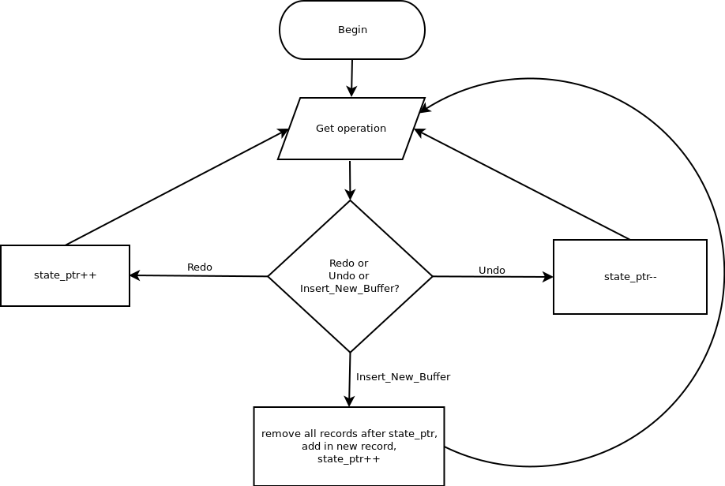
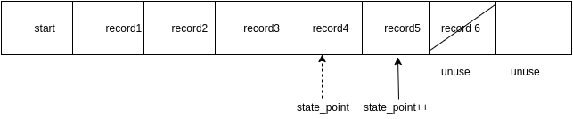

# Design Justifications for FlashPhoto
#### Group Name:
Group-A01

#### Members:
- Tiannan Zhou
- Yu Xian Ang
- Zhangjun Xu

#### Instructions
> Respond to each of the design questions below.  Make your answers factual and compelling.  Where appropriate, reference alternative designs you considered, code snippets, and diagrams within your writing in order to be clear and back up your claims.  As we have discussed in class, when writing with reference to figures make sure to tell the reader what to look for in the diagram or what exactly you want the reader to notice in the code snippet.  Remember that the design of your project is worth 1/3 of the total project grade.  Also remember that when grading the design portion of the project, this design justification document is the only thing we will look at.  This document must stand on its own.  Rather than linking to your actual code, carefully pick the most important code snippets from your project to include here in order to provide convincing detail for your answers to the questions below.  
> A few tips to maximize the success of your design document:  
>   1. Make sure the **description** of your design decision only contains an objective description of how you structured your design and how it was implemented (specifically how your solution solves the problem given in the prompt). Save any arguments in favor of your design for the **justification** section.
>
>   2. Your justification will probably need to compare against at least one alternative, and you will need to provide a compelling argument for why your solution is better than the alternative.
>
>   3. Edit this file when writing your design document. Do not move or rename this file. Do not direct to any outside resources for your images or code. Place all images and code in this document. Please match the formatting of the [Example Design Document](https://github.umn.edu/umn-csci-3081F16/Example-Design-Document/blob/master/doc/DesignDocument.md) and [its source](https://raw.github.umn.edu/umn-csci-3081F16/Example-Design-Document/master/doc/DesignDocument.md?token=AAADyd5L8wd57F_qLX4Nf-2nVvfRlMj5ks5YH-qHwA%3D%3D) as precisely as possible, especially in regards to:
>     - **Formatting code** (do not include images of your code, make sure that your code is formatted with C++ coloring)
>     - **Inserting images**
>     - **Numbered lists for your tutorial**
>     - **Captioning your Figures**
>     - **Including the original prompts in their original quote form**  
>
>  This formatting helps us grade your assignments effectively, and thus failure to meet these requirements may result in point deductions. Any material that is not presented in this design document will not be graded.
>   4. When including a class diagram, only show the classes and members that convey the point you're trying to make. For example, showing the class BaseGfxApp in a UML diagram will probably not be appropriate.


## 1  Design Question One
> This iteration of the project introduces the concept of filters. You had to implement several filters, which fell into two types: pixel-independent (where each pixel is filtered independently), and convolution-based (where filtering a pixel requires information about its neighboring pixels by means of a kernel). Naturally, a key design decision is how these filters are represented. Each filter has a different algorithm for modifying the canvas, and only some of these algorithms require kernels.
> First, in the **Design Description** section below, describe the design you developed to address this challenge. We expect that you will include at least one figure showing the relationships of the classes affected by your design. Second, in the **Design Justification** section below present the most compelling argument you can for why this design is justified.  Note that our expectation is that you will need to discuss the pros (and maybe cons) of your final design as compared to alternative designs that you discussed in your group in order to make a strong case for justifying your design.

### 1.1 Design Description
In our final software design, we decided to use simple factory method. The key idea of this method is to isolate changes. We moved the filter instance creations out of filter manager. This is to encapsulate object creation in its own class. Figure 1.1 is a UML diagram of the implementation of our filter factory.


###### Figure 1.1: UML of FilterFactory, FilterMatrix and other filters


From Figure 1.1, we could clearly see that FilterFactory is like a factory producing filters and those filters are a subclass of an abstract base class called FilterMatrix. To implement this design in C++, we fully utilized the simple factory method. Figure 1.2 and 1.3 show the implementation of FilterFactory.


###### Figure 1.2: class snippet of FilterFactory in filter_factory.h
```C++
/**
 * @brief Implementation of factory pattern to handle filters creation
 * This enables easy extension/addition of new filters.
 */
class FilterFactory {
 public:
  /**
   * @brief The list of filters that can be created by the factory and used by
   * the application
   */
  enum FILTERS {
    F_BLUR = 0,
    F_MOTION = 1,
    F_SHARPEN = 2,
    F_EDGE = 3,
    F_THRESHOLD = 4,
    F_SATURATION = 5,
    F_CHANNEL = 6,
    F_QUANTIZE = 7,
    F_EMBOSS = 8,
    NUMFILTERS = 9
  };

  /**
   * @brief Return the total # of tools in the application
   */
  static int num_filters(void) { return NUMFILTERS; }

  /**
   * @brief Create a filter from the list of defined filters
   * @return The initialized filter, or nullptr if an invalid index was passed
   */
  static FilterMatrix* CreateFilter(int filter_id);
};
```

###### Figure 1.3: class snippet of CreateFilter function in f_factory.cc
```C++
#include "include/filter_factory.h"
#include "include/filter_manager.h"
#include "include/f_blur_matrix.h"
#include "include/f_edge_matrix.h"
#include "include/f_threshold_filter.h"
#include "include/f_saturation_filter.h"
#include "include/f_rgb_filter.h"
#include "include/f_quan_filter.h"
#include "include/f_emboss_matrix.h"

namespace image_tools {

FilterMatrix* FilterFactory::CreateFilter(int filter_id) {
  FilterMatrix* filter = nullptr;
  switch (filter_id) {
    case F_BLUR:
      filter = new BlurMatrix();
      break;
    case F_MOTION:
      filter = new BlurMatrix();
      break;
    case F_SHARPEN:
      filter = new EdgeMatrix();
      break;
    case F_EDGE:
      filter = new EdgeMatrix();
      break;
    case F_THRESHOLD:
      filter = new ThresholdFilter();
      break;
    case F_SATURATION:
      filter = new SaturationFilter();
      break;
    case F_CHANNEL:
      filter = new RGBFilter();
      break;
    case F_QUANTIZE:
      filter = new QuanFilter();
      break;
    case F_EMBOSS:
      filter = new EmbossMatrix();
      break;
    default:
      filter = nullptr;
      break;
  }

  return filter;
}

}
```

Notice that in Figure 1.2, we used enum instead of strings to decide which filter to generate. We also implemented a function called CreateFilter to instantiate the filters and pass them to the “store”, FilterManager. The implementation of CreateFilter is shown in Figure 1.3.


All filters we implemented can be separated to 2 types, pixel-independent and convolution-based. But, all filters are still very similar, so we used an abstract base class, called FilterMatrix, to implement these filters. The similarity of these filters are they have a kernel and they apply the kernel onto every pixel in the display. Figure 1.4 is a snippet of the implementation of FilterMatrix.


###### Figure 1.4: class snippet of FilterMatrix in filter_matrix.h
```C++
/**
 * @brief This class is the matrix tool which would be used by FilterManager
 */
class FilterMatrix {
 public:
  FilterMatrix();
  virtual ~FilterMatrix() {}
  /**
   * @brief apply a new size for a filter matrix
   *
   * @param[in] incoming_size the new size of this matrix
   */
  virtual void Resize(float incoming_size, float args_for_resize) {}
  virtual void Resize(float incoming_size, float r, float g, float b) {}
  /**
   * @brief apply the matrix on the buffer then return the cached buffer
   *
   * @param[in] original_buffer the display_buffer of GUI
   */
  virtual PixelBuffer* ApplyMatrix(PixelBuffer* original_buffer);

  int MatrixSize(void);

  void MatrixSize(int new_matrix_size);

  std::vector <std::vector<float> > Matrix(void);

  void Matrix(std::vector <std::vector<float> > new_matrix);

 private:
  int  matrix_size_;
  std::vector <std::vector<float> > matrix_;
};
```

Notice in Figure 1.4, we have a matrix declared as a vector. This matrix works as a kernel for convolution-based filter. To fit it into different filters, we also implemented a function to initialize it, the function is called Resize. Note that we implemented 2 Resize virtual functions that take different arguments. The Resize function that takes 4 arguments is specially implemented for rgb filter while another Resize function is for the rest of the filters. Figure 1.3 is a snippet of Resize function from rgb filter and Figure 1.4 is a snippet from the caller function ApplyChannel in FilterManager.


###### Figure 1.5: Resize function of RGBFilter in f_rgb_filter.cc
```C++
void RGBFilter::Resize(float incoming_size,
                       float r_amount,
                       float g_amount,
                       float b_amount) {
  this->channel_color_red_ = r_amount;
  this->channel_color_green_ = g_amount;
  this->channel_color_blue_ = b_amount;
  int new_matrix_size = static_cast<int>(incoming_size);
  std::vector <std::vector<float> > new_matrix;
  new_matrix.resize(new_matrix_size, std::vector<float>(new_matrix_size));
  new_matrix[0][0] = 1;
  FilterMatrix::MatrixSize(new_matrix_size);
  FilterMatrix::Matrix(new_matrix);
}

PixelBuffer* RGBFilter::ApplyMatrix(PixelBuffer* original_buffer) {
  PixelBuffer* result_buffer;
  ColorData temp_color;
  result_buffer = new PixelBuffer(original_buffer->width(),
                                  original_buffer->height(),
                                  original_buffer->background_color());
  for (int x = 0; x < result_buffer->width(); x++)
    for (int y = 0; y < result_buffer->height(); y++) {
      temp_color = original_buffer->get_pixel(x, y);
      temp_color.red(temp_color.red() * this->channel_color_red_);
      temp_color.green(temp_color.green() * this->channel_color_green_);
      temp_color.blue(temp_color.blue() * this->channel_color_blue_);
      result_buffer->set_pixel(x, y, temp_color);
    }
  result_buffer->ValidPixel();
  return result_buffer;
}
```

###### Figure 1.6: ApplyChannel from FilterManager in filter_manager.cc
```C++
void FilterManager::ApplyChannel(PixelBuffer** display_buffer) {
  std::cout << "Apply has been clicked for Channels with red = "
            << channel_color_red_
            << ", green = " << channel_color_green_
            << ", blue = " << channel_color_blue_ << std::endl;
  filters_[6]->Resize(1,
                      channel_color_red_,
                      channel_color_green_,
                      channel_color_blue_);
  *display_buffer = filters_[6]->ApplyMatrix(*display_buffer);
}
```

Notice in Figure 1.6, the caller function calls the Resize function with 1 as the incoming size. The incoming size is the size of the matrix, you can see the related operation in Figure 1.5, so size as 1 means it is pixel-independent. The other 3 arguments are put into the class variables of rgb filter. Convolution-based filter has a different implementation in Resize function. For an example, blur filter is a classic convolution-based filter. Figure 1.7 is a snippet of the Resize function of blur filter class, BlurMatrix. Figure 1.8 is the caller function.


###### Figure 1.7: Resize function of BlurMatrix in f_blur_matrix.cc
```C++
void BlurMatrix::Resize(float incoming_size, float blur_type) {
  this->blur_type_ = static_cast<int>(blur_type);
  int n = static_cast<int>(incoming_size) / 2;
  int new_matrix_size = n * 2 + 1;
  std::vector <std::vector<float> > new_matrix;
  new_matrix.resize(new_matrix_size, std::vector<float>(new_matrix_size));
  if (this->blur_type_ == -1) {
    float tot_cell = 2 * n * n + 2 * n + 1;
    float value_in_cell = 1.0 / tot_cell;
    for (int i = 0; i < new_matrix_size; i++) {
      for (int j = 0; j < new_matrix_size; j++) {
        int dis = std::abs(i - n) + std::abs(j - n);
        if (dis <= n)
          new_matrix[i][j] = value_in_cell;
        else
          new_matrix[i][j] = 0;
      }
    }
  } else {
    new_matrix.clear();
  }
  FilterMatrix::MatrixSize(new_matrix_size);
  FilterMatrix::Matrix(new_matrix);
}
```


###### Figure 1.8: ApplyBlur from FilterManager in filter_manager.cc
```C++
void FilterManager::ApplyBlur(PixelBuffer** display_buffer) {
  std::cout << "Apply has been clicked for Blur with amount = "
            << blur_amount_ << std::endl;
  filters_[0]->Resize(blur_amount_, -1);
  *display_buffer = filters_[0]->ApplyMatrix(*display_buffer);
}
```


Note that in the caller function ApplyBlur, it passes a variable, blur_amount_, as an incoming size to BlurMatrix’s Resize function. The blurriness of an image is based on the size of the kernel, the larger the size, the blurrier the effect. Notice the caller function also passes -1 as blur_type to the Resize function. This is because we implemented BlurMatrix in a way that can produce 2 types of blur filter, normal blur and motion blur. If the blur_type is -1, it means it is a normal blur filter, otherwise it means it's a motion blur filter and the number of blur_type indicates the direction.

ApplyMatrix is another function that all filter has. This function is to apply the kernel into the display. Figure 1.9 is a snippet of ApplyMatrix for most of the convolution-based filter, this is implemented in the base class FilterMatrix.


###### Figure 1.9: ApplyMatrix from FilterMatrix in filter_matrix.cc
```C++
PixelBuffer* FilterMatrix::ApplyMatrix(PixelBuffer* original_buffer) {
  PixelBuffer* result_buffer;
  ColorData temp_color;
  result_buffer = new PixelBuffer(original_buffer->width(),
                                  original_buffer->height(),
                                  original_buffer->background_color());
  for (int x = 0; x < original_buffer->width(); x++)
    for (int y = 0; y < original_buffer->height(); y++) {
      temp_color = ColorData(0, 0, 0);
      int shift_length = matrix_size_ / 2;
      for (int i = 0; i < matrix_size_; i++)
        for (int j = 0; j < matrix_size_; j++) {
          if (matrix_[i][j] > 0 || matrix_[i][j] < 0) {
            int s_x = x + i - shift_length;
            int s_y = y + j - shift_length;
            if (s_x >= 0 && s_y >= 0 &&
                s_x < original_buffer->width() &&
                s_y < original_buffer->height()) {
              temp_color = original_buffer->get_pixel(s_x, s_y) *
                           matrix_[i][j] +
                           temp_color;
            } else {
              if (matrix_[i][j] > 0)
                temp_color = ColorData() * matrix_[i][j] + temp_color;
              else
                temp_color = original_buffer->get_pixel(x, y) *
                             matrix_[i][j] + temp_color;
            }
          }
      }
      result_buffer->set_pixel(x, y, temp_color);
    }
  result_buffer->ValidPixel();
  return result_buffer;
}
```


The algorithm used in ApplyMatrix is suitable for some convolution-based filters such as blur filter, edge filter and our special filter, emboss filter. Speaking of algorithm, we also implemented a better algorithm in allusion to motion blur. In the optimized algorithm, we ignored most empty cells in the matrix and only calculate out the answer ColorData by axis or diagonal elements in the matrix, which determined by the practice direction. This optimized algorithm's expected runtime is O(n) and it is acceptable in the scale within one hundred. The original algorithm (ApplyMatrix)’s runtime is O(n^2), which is much slower than the optimized motion blur. Figure 1.10 is a snippet of ApplyMatrix function BlurMatrix.


###### Figure 1.10: ApplyMatrix function BlurMatrix in f_blur_matrix.cc
```C++
PixelBuffer* BlurMatrix::ApplyMatrix(PixelBuffer* original_buffer) {
  if (this->blur_type_ == -1) {
    return FilterMatrix::ApplyMatrix(original_buffer);
  } else {
    int n = MatrixSize() / 2;
    PixelBuffer* result_buffer;
    ColorData temp_color;
    float tot_cell = MatrixSize();
    float value_in_cell = 1.0 / tot_cell;
    int init_x, init_y;
    int delta_x, delta_y;
    if (this->blur_type_ == 0) {
      init_x = n;
      init_y = 0;
      delta_x = 0;
      delta_y = 1;
    } else if (this->blur_type_ == 1) {
      init_x = 0;
      init_y = n;
      delta_x = 1;
      delta_y = 0;
    } else if (this->blur_type_ == 2) {
      init_x = 0;
      init_y = 0;
      delta_x = 1;
      delta_y = 1;
    } else if (this->blur_type_ == 3) {
      init_x = 0;
      init_y = MatrixSize() - 1;
      delta_x = 1;
      delta_y = -1;
    }
    result_buffer = new PixelBuffer(original_buffer->width(),
                                    original_buffer->height(),
                                    original_buffer->background_color());

    for (int x = 0; x < original_buffer->width(); x++)
      for (int y = 0; y < original_buffer->height(); y++) {
        temp_color = ColorData(0, 0, 0);
        for (int i = 0, d_x = init_x, d_y = init_y;
             i < MatrixSize();
             d_x += delta_x, d_y += delta_y, i++) {
          int s_x = x + d_x - n;
          int s_y = y + d_y - n;
          if (s_x >= 0 && s_y >= 0 &&
              s_x < original_buffer->width() &&
              s_y < original_buffer->height()) {
            temp_color = original_buffer->get_pixel(s_x, s_y) *
                         value_in_cell +
                         temp_color;
          } else {
            temp_color = ColorData() *
                         value_in_cell + temp_color;
          }
        }
        result_buffer->set_pixel(x, y, temp_color);
      }
      result_buffer->ValidPixel();
      return result_buffer;
  }
}
```


As we mentioned, if the type is -1 that is the normal blur, that means we would use the original algorithm, else it is motion blur, then we would use the optimized algorithm for each direction.

Finally, it is worth noting that the developer does not have to know the implementation in these filters to use them. They just have to know how to the Resize and ApplyMatrix function and some specific conditions like for normal blur, the blur type is -1. After calling ApplyMatrix function, it will return the display with effects.

### 1.2 Design Justification
The intuition of the program design above is to create an extensible, reliable and easily maintained program. We also thought of other alternative designs that are functional in this project, but we decided to use the final program design because it is significantly better in maintainability and extensibility compared to other alternative designs.

Our initial design is based on “brute force” approach. The “brute force” approach is focus on simplicity. Thus, we just implement those filters in their respective functions. Although this is easier to implement, it is very difficult to maintain. Figure 1.11 is a replica of the “brute force” approach.


###### Figure 1.11: Brief sample “brute force” approach filter code
```C++
void ApplyFilter(PixelBuffer** display_buffer) {
  // initialize kernel
  // apply kernel to every pixel in display_buffer
}
```


From the Figure 1.11, it is obvious that the whole program will be a mess. It will be very difficult to maintain it. However, it is simple to implement because the whole function represents the filter itself. Although, this is a lot easier for us to implement it compared to our final design, we still argue that “brute force” approach has major disadvantage in terms of maintainability and extensibility.


For example, adding a new feature into an existing filter. The new feature is to enable the user to change the intensity of the existing filter. To implement this new feature, we have to look into the code and find where to put it so that it won’t affect other filters. Maybe it is considered easy for a few filters, but if more and more features and filters added? Then, we need very large functions and many functions to include all these features and filters. In contrast to this, our final design is simpler and cleaner because all these filters are inside their respective classes. Moreover, simple factory method is good at isolating creation of classes, so they won’t affect each other if only adding things inside their own classes or maybe some effects that will occurred during creation will be avoided. Thus, our final design is more robust and easier to read, extend and maintain.


We also have another alternative design that uses almost the same design but not using the simple factory method, only uses the abstract base class strategy. They might be similar and very little difference at this stage, but when the program grows bigger, our final design, simple factory method, will works better than pure abstract base class. This is because simple factory method has the advantage of encapsulating object creation and also the criterias of certain objects. For example, for certain filters, they needed some specific criterias during creation. If we use pure abstract base class strategy, we have to repeat the codes every places we create the classes. But if we use simple factory method, we do not have to repeat it. This shows simple factory method has a greater extensibility than pure abstract base class strategy.


We argued that our final design is more robust and better in isolation, maintainability and extensibility, but, to implement this design, much more complex knowledge of object-oriented programming and logic is needed. For example, we want to add a new feature to several filters but it is implemented differently in different filters. We would likely have to look through the relationships between these filters and discover the right place to implement the new feature.

## 2  Design Question Two
> One common software feature included in this iteration is the undo/redo mechanic, where any modification to the canvas can be reversed, and then optionally re-applied.
> First, in the **Design Description** section below, describe the design you developed to address this challenge.  Second, in the **Design Justification** section below present the most compelling argument you can for why this design is justified.  Note that our expectation is that you will need to discuss the pros (and maybe cons) of your final design as compared to alternative designs that you discussed in your group in order to make a strong case for justifying your design.

### 2.1 Design Description
For our final redo/undo design, we decided to use Vector as our data structure to store our previous pixel buffers in that vector and named it `cached_buffer_`. We implemented the redo/undo based on `cached_buffer_`. Figure 2.1 is a flowchart of our redo/undo tool.

###### Figure 2.1: flowchart of redo/undo


To implement those function design in C++ code, first for all, we set the functions will be called as part of our frame. Figure 2.2 shows our implementation of redo/undo in C++ code.

###### Figure 2.2: Class snippet of StateManager in state_manager.h
```C++
class StateManager {
 public:
  StateManager();
  ~StateManager();

  void InitGlui(const GLUI *const glui,
                void (*s_gluicallback)(int));


  /**
   * @brief Undoes the last operation applied to the canvas (not permanently; it
   * can still be re-done later)
   *
   */
  void UndoOperation(PixelBuffer** display_buffer);


  /**
   * @brief Re-does the last un-done operation applied to the canvas (not
   * permanently; it can be undone again later)
   *
   */
  void RedoOperation(PixelBuffer** display_buffer);

  void InsertNewBuffer(PixelBuffer* new_buffer);

 private:
  std::vector <PixelBuffer*> cached_buffer_;
  int size_limit_;
  int state_ptr_;
  ...
};
```
As the code shown above, we declared a vector named cached_buffer_  as i mentioned before, and set the type value stored to `PixelBuffer*`. We also have two variable called `state_ptr_`, which indicates the current state and `size_limit_`, which indicates the upper limit of our vector for further memory usage control. In addition, we also have three functions, “RedoOperation”  , “RedoOperation”  and  “InsertNewBuffer”. And they are called in the flashphoto_app.cc. The Figure 2.3 shows how those function are called partially.

Please note that we inserted the initial `display_buffer_` into the vector by InsertNewBuffer method when the program starts. And we also do this each time if any modification is made on the canvas. That help us ensure that every step of canvas would be stored in the vector and can be handled by StateManager together.

###### Figure 2.3: Code snippet of Flashphoto in flashphoto.cc
```C++
void FlashPhotoApp::GluiControl(int control_id) {
  switch (control_id) {
     /*
      * Part of code omit  	
      *
      *
      */
    case UICtrl::UI_LOAD_CANVAS_BUTTON:
      PixelBuffer* temp_buffer;
      if ((temp_buffer = io_manager_.LoadImageToCanvas()) != NULL) {
        display_buffer_ = temp_buffer;
        SetWindowDimensions(display_buffer_->width(),
                            display_buffer_->height());
        state_manager_.InsertNewBuffer(display_buffer_);
      }
      break;
   ……
   ……
    case UICtrl::UI_SAVE_CANVAS_BUTTON:
      io_manager_.SaveCanvasToFile(this->display_buffer_);
      // Reload the current directory:
      io_manager_.file_browser()->fbreaddir(".");
      break;
    case UICtrl::UI_FILE_NAME:
      io_manager_.set_image_file(io_manager_.file_name());
      break;
    case UICtrl::UI_UNDO:
      state_manager_.UndoOperation(&display_buffer_);
      SetWindowDimensions(display_buffer_->width(),
                          display_buffer_->height());
      break;
     ……
     ……
    default:
      break;
  }
……
}
```
Notice the code above,the records were inserted into our `cached_buffer_` when change occurs on the canvas, loading images included. The figure 2.4 shows how does the records are saved in `cached_buffer_` since the program starts.


###### Figure 2.4 buffer stored in the cache


###### Figure 2.5 how does the undo operation works


Figure 2.5 shows how the undo operation works when the undo function been called. Meanwhile, the function will move the state_point to the left (imaginary line, w.l.o.g., left side is the oldest and right side is the newest) by one position to record 4.


###### Figure 2.6 how does the redo operation work


The figure 2.6 shows how the redo works. This is a really simple idea, if we did not modify anything on current buffer, then `state_ptr_` will increase by one and move from record 4 to record 5. However, if we modified the pixel buffer, then the operation is different, as the figure 2.7, how we will reorganize our vector.


###### Figure 2.7 how we will reorganize our vector


The figure above clearly shows that we will replace the record 5 with the new record and  clear the rest of the records. As the figure 2.7 shows the record 5 has been replaced, which actually is deleting the old record 5 and inserting the new PixelBuffer. Please note, the buffers after the current `state_ptr` must be deleted before we insert the new buffer in order to avoid memory leak.

We also control the memory usage here by `size_limit_` to avoid too much memory used in storing too old cached buffers. In our case, the limit is 100, which is initialized in the constructor. It means we can undo at most 100 times in our FlashPhoto application and it's a reasonable limitation since each PixelBuffer needs about 5MB memory and 0.5GB is the biggest acceptable memory used in caching PixelBuffers from our perspective. For each time the size of vector bigger than the limit, we would erase the oldest elements (of course, we would delete the pointers before we clean them in the vector) to decrease the size to 100. This can help us make sure the memory usage would be safe after long time running of our program.

The code below shows how we implement function InsertNewBuffer which is useed to insert a new PixelBuffer.

###### Figure 2.8: InsertNewBuffer, UndoOperation and RedoOperation From StateManager in state_manager.cc
```C++
void StateManager::InsertNewBuffer(PixelBuffer* new_buffer) {
  for (int i = static_cast<int>(this->cached_buffer_.size()) - 1;
       i > state_ptr_;
       i--) {
    delete this->cached_buffer_[i];
    this->cached_buffer_.erase(this->cached_buffer_.begin() + i);
  }
  this->cached_buffer_.push_back(new_buffer);
  state_ptr_++;
  if (state_ptr_ < static_cast<int>(this->cached_buffer_.size()) - 1)
    redo_toggle(true);
  else
    redo_toggle(false);
  if (state_ptr_ > 0)
    undo_toggle(true);
  else
    undo_toggle(false);
  if (static_cast<int>(this->cached_buffer_.size()) > this->size_limit_) {
    int shift_val = static_cast<int>(this->cached_buffer_.size()) -
                    this->size_limit_;
    for (int i = 0; i < shift_val; i++) {
      delete this->cached_buffer_[0];
      this->cached_buffer_.erase(this->cached_buffer_.begin());
      std::cout << "poped the first ptr due to oversize\n" << std::endl;
      state_ptr_--;
    }
  }
  std::cout << "Current state_ptr: " << state_ptr_ << std::endl;
}
```

That is all how we define the redo and undo in our project.

### 2.2 Design Justification
The justification for our redo/undo design is simple. As we mentioned above, we will clean and reorganize our pixel buffer as shown in figure 2.7. Therefore, we have three options to select as our data structure: queue, stack, list or vector. However, queue follows the principle of first in and first out. Thus, we are unable to remove the elements to the right when a new record is stored in the middle of the queue. The similar situation will occur when we choose stack as our data structure. To save our record, according to the rule of the stack, we can not remove the element at the front of our list when it reaches the limit of undo. Besides queue and stack, we could use list but we need 2 lists to implement undo/redo. Figure below shows how are we going to implement if we are using list as our data structure.

###### Figure 2.9: List version of redo/undo
```C++
void StateManager::UndoOperation(PixelBuffer** display_buffer) {
  // Store latest record of undo list into redo list
  // Remove the latest record of undo list
  // Set display_buffer to the latest record of the undo list
}

void StateManager::RedoOperation(PixelBuffer** display_buffer) {
  // Store latest record of redo list into undo list
  // remove the latest record of redo list
  // set display_buffer to the latest record of the undo list
}

void StateManager::InsertNewBuffer(PixelBuffer* new_buffer) {
  // Store current buffer into undo list
  // clear all records in redo list
}
```

From Figure 2.9, we can see that 2 lists is more complicated and it uses more memory compared to the latest design we used with vector. Vector is a perfect choice and fulfills what we want. The vector library provides a function called eraser() that could either remove the element from the end or from the front of vector. This function helps us to implement the records into one vector only. Apparently, vector is a better data structure to implement redo/undo features.


## 3  Design Question Three
> A new developer on your team must add a new filter to FlashPhoto. This filter is called  _Invert._ This filter performs the following conversion to all pixels in the canvas:
> ```
> newColor's red   = 1 - oldColor's red
> newColor's green = 1 - oldColor's green
> newColor's blue  = 1 - oldColor's blue
> ```
> Describe in the form of a tutorial (including code snippets) exactly what changes would need to be made to your program in order to fully integrate this new filter.

1) To add a new filter, first, you have to implement a subclass of FilterMatrix called InvertFilter. The respective files are f_invert_filter.h and f_invert_filter.cc. Here's the brief implementation of these two source files. Since this is a pixel-independent filter and it does not need to be resized, we just need to overwrite the ApplyMatrix member function this time.

###### src/include/f_invert_filter.h
```C++
#ifndef SRC_INCLUDE_F_INVERT_FILTER_H_
#define SRC_INCLUDE_F_INVERT_FILTER_H_

#include "include/filter_matrix.h"

namespace image_tools {

Class InvertFilter : public FilterMatrix{
 public:
  InvertFilter() : FilterMatrix::FilterMatrix() {}
  ~InvertFilter() {}

  PixelBuffer* ApplyMatrix(PixelBuffer* original_buffer);

};
}  // namespace image_tools

#endif  // SRC_INCLUDE_F_INVERT_FILTER_H_
```


###### src/f_invert_filter.cc
```C++
#include "include/f_invert_filter.h"

namespace image_tools {
PixelBuffer* InvertFilter::ApplyMatrix(PixelBuffer* original_buffer) {
  // Create a new instance of PixelBuffer
  PixelBuffer* result_buffer;
  result_buffer = new PixelBuffer(original_buffer->width(),
                                  original_buffer->height(),
                                  original_buffer->background_color());
  for (int x = 0; x < result_buffer->width(); x++)
    for (int y = 0; y < result_buffer->height(); y++) {
      temp_color = original_buffer->get_pixel(x, y);
      temp_color.red(1.0 - temp_color.red());
      temp_color.green(1.0 - temp_color.green());
      temp_color.blue(1.0 - temp_color.blue());
      result_buffer->set_pixel(x, y, temp_color);
    }
  // Check the validness and return the result PixelBuffer
  result_buffer->ValidPixel();
  return result_buffer;
}
}
```

2) Then, we have to add the creation of the filter into FilterFactory. We just need to assign a filter number for the new filter, increase the total number of filters and added the initialization steps of this filter in filter_factory.cc. Don't forget to include the headfile f_invert_matrix.h.

###### filter_factory.h
```C++
#include "include/f_invert_matrix.h"

class FilterFactory {
 public:
  /**
   * @brief The list of filters that can be created by the factory and used by
   * the application
   */
  enum FILTERS {
    ...
    F_INVERT = 9,
    NUMFILTERS = 10
  };
  ...
};

}
```


###### f_factory.cc
```C++
...
#include "include/f_invert_filter.h"

FilterMatrix* FilterFactory::CreateFilter(int filter_id) {
  FilterMatrix* filter = nullptr;
  switch (filter_id) {
    ...
    Case F_INVERT:
      filter = new InvertMatrix();
      break;
    ...
  }
  return filter;
}
...
}
```


3) Finally, you have to add Invert Button on GUI and build a call back function for the button inside FilterManager. You have to add the declaration in filter_manager.h and the caller itself inside filter_manager.cc.


###### filter_manager.h
```C++
...
namespace image_tools {

class FilterManager {
 public:
   …
   void ApplyInvert(PixelBuffer** display_buffer);
   …  
};
}
```


###### filter_manager.cc
```C++
#include "include/filter_manager.h"
#include <iostream>
#include "include/ui_ctrl.h"


namespace image_tools {
…
void FilterManager::ApplyInvert(PixelBuffer** display_buffer) {
  std::cout << "Apply has been clicked for Invert" << std::endl;
  temp_buffer_ = filters_[9]->ApplyMatrix(*display_buffer);
  *display_buffer = temp_buffer_;
}
…
}
```
